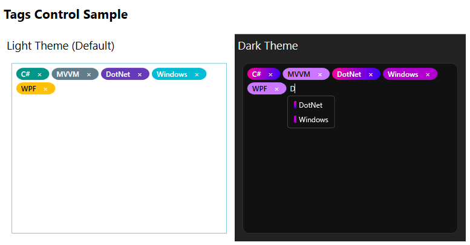

# TagsControl

 

Это элемент управления WPF для управления коллекциями тегов с визуальными подсказками и функцией автозавершения.



## Обзор

TagsControl - это повторно используемый элемент управления WPF, который позволяет пользователям управлять коллекциями тегов через интуитивный интерфейс. Он поддерживает добавление тегов путем ввода и выбора из предложений, удаление отдельных тегов и предоставляет цветовую визуализацию для лучшей организации.

## Особенности

- **Управление тегами**: Добавление, удаление и редактирование тегов с визуальными подсказками
- **Подсказки автозавершения**: Вводите текст, чтобы увидеть доступные теги в реальном времени
- **Цветовые теги**: Каждый тег получает уникальный цвет на основе его отображаемого имени
- **Настраиваемый внешний вид**: Настройка цветов, границ и других визуальных свойств
- **Двусторонняя привязка данных**: Безопасная интеграция с паттернами MVVM
- **Адаптивный дизайн**: Адаптируется к различным размерам контейнеров

## Начало работы

### Предварительные требования

- .NET Framework 4.7.2 или выше
- Visual Studio 2019 или выше (рекомендуется)

### Установка

1. Добавьте проект TagsControl в ваше решение
2. Ссылайтесь на проект TagsControl в вашем WPF приложении
3. Включите элемент управления в ваш XAML:

```xml
<Window x:Class="YourApp.MainWindow"
        xmlns="http://schemas.microsoft.com/winfx/2006/xaml/presentation"
        xmlns:x="http://schemas.microsoft.com/winfx/2006/xaml"
        xmlns:tags="clr-namespace:TagsControl;assembly=TagsControl">

    <Grid>
        <tags:TagsControl ItemsSource="{Binding AvailableTags}"
                          SelectedTags="{Binding SelectedTags}" />
    </Grid>
</Window>
```

## Использование

### Свойства

| Свойство | Тип | Описание |
|----------|------|-------------|
| `ItemsSource` | `IEnumerable<TagItem>` | Коллекция доступных тегов для выбора |
| `SelectedTags` | `IList<TagItem>` | Коллекция текущих выбранных тегов |
| `TagsBackgroundBrushes` | `ObservableCollection<Brush>` | Пользовательская палитра цветов для тегов |
| `BorderCornerRadius` | `CornerRadius` | Радиус скругления внешней границы |
| `InnerBorderBrush` | `Brush` | Кисть для внутренней границы |
| `InnerBorderThickness` | `Thickness` | Толщина внутренней границы |
| `InnerBackground` | `Brush` | Кисть фона для внутренних элементов |

### Модель данных

Элемент управления использует модель `TagItem`, которая имеет два свойства:

```csharp
public class TagItem
{
    public string DisplayName { get; set; }  // Текст для отображения в теге
    public string Value { get; set; }        // Внутренний идентификатор
}
```

## Пример использования

В вашем ViewModel:

```csharp
public class MainViewModel : INotifyPropertyChanged
{
    public ObservableCollection<TagItem> AvailableTags { get; set; }
    public ObservableCollection<TagItem> SelectedTags { get; set; }

    public MainViewModel()
    {
        AvailableTags = new ObservableCollection<TagItem>
        {
            new TagItem("C#", "c_sharp"),
            new TagItem("MVVM", "mvvm"),
            new TagItem("XAML", "xaml"),
            new TagItem("DotNet", "dotnet")
        };

        SelectedTags = new ObservableCollection<TagItem>();
    }
}
```

В вашем XAML:

```xml
<tags:TagsControl ItemsSource="{Binding AvailableTags}"
                  SelectedTags="{Binding SelectedTags}" />
```

## Настройка

### Пользовательские цвета

Для настройки цветов тегов установите свойство `TagsBackgroundBrushes`:

```xml
<tags:TagsControl ItemsSource="{Binding AvailableTags}"
                  SelectedTags="{Binding SelectedTags}">
    <tags:TagsControl.TagsBackgroundBrushes>
        <SolidColorBrush Color="Red"/>
        <SolidColorBrush Color="Blue"/>
        <SolidColorBrush Color="Green"/>
    </tags:TagsControl.TagsBackgroundBrushes>
</tags:TagsControl>
```

## Вклад в проект

1. Сделайте форк репозитория
2. Создайте ветку функции
3. Зафиксируйте изменения
4. Отправьте в ветку
5. Создайте Pull Request

## Лицензия

Этот проект лицензирован по MIT License - см. файл `LICENSE.md` для подробностей.